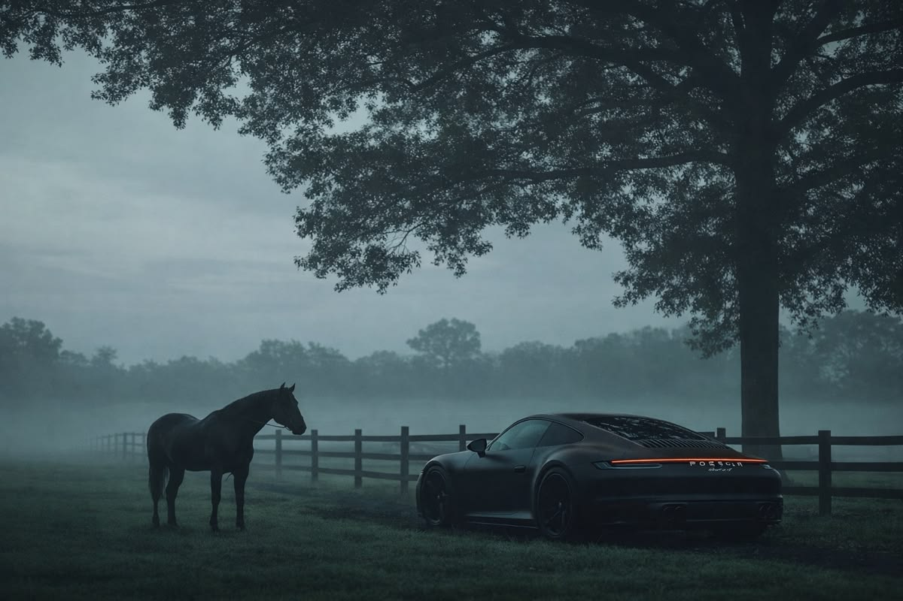

<!-- Deep Dark Blue & Aurora Light Blue Header Banner -->

  <!-- Option 1: Animated Aurora Header Banner -->
  

  <!-- Note: If you want to use a uploaded background image file (e.g. banner.jpg) instead, replace the  tag above with:
  
  -->

    

  <!-- Fast Typewriter Animated SVG -->
  

    

  <!-- Profile Visitor Counter -->
  

 

---

<!-- Top Brand Showcase Section -->

  <table>
    <tr>
      <td align="center" width="240">
        
      </td>
      <td valign="middle">
        <h2>⚡ Brand: SoloX</h2>
        
<b>Creator:</b> Rence Pacifico Samontanez

        
Architecting digital experiences with a focus on deep dark aesthetic UIs, fluid animations, and scalable full-stack JavaScript/React applications.

        
<i>"Engineered for speed, crafted for aesthetics."</i>

      </td>
    </tr>
  </table>

---

### 🛠️ Tech Stack & Ecosystem

  

---

### 📊 Performance & Analytics

  <picture>
    <source media="(prefers-color-scheme: dark)" srcset="https://github-readme-stats.vercel.app/api?username=RenceSamontanez&show_icons=true&theme=tokyonight&hide_border=true&count_private=true&title_color=38bdf8&icon_color=7dd3fc&bg_color=030712">
    <source media="(prefers-color-scheme: light)" srcset="https://github-readme-stats.vercel.app/api?username=RenceSamontanez&show_icons=true&theme=default&hide_border=true&count_private=true">
    
  </picture>
  <picture>
    <source media="(prefers-color-scheme: dark)" srcset="https://github-readme-stats.vercel.app/api/top-langs/?username=RenceSamontanez&layout=compact&theme=tokyonight&hide_border=true&title_color=38bdf8&langs_count=6&bg_color=030712">
    <source media="(prefers-color-scheme: light)" srcset="https://github-readme-stats.vercel.app/api/top-langs/?username=RenceSamontanez&layout=compact&theme=default&hide_border=true&langs_count=6">
    
  </picture>

  

---

### 🎮 Contribution Snake

  <picture>
    <source media="(prefers-color-scheme: dark)" srcset="https://raw.githubusercontent.com/RenceSamontanez/RenceSamontanez/output/github-snake-dark.svg">
    <source media="(prefers-color-scheme: light)" srcset="https://raw.githubusercontent.com/RenceSamontanez/RenceSamontanez/output/github-snake.svg">
    
  </picture>

---

### 📫 Connect With Me

  
  
  
  
  
  

<!-- Dark Blue / Light Blue Watercolor Gradient Banner -->

  

 

---

<!-- Bottom Signature Card -->

  <table>
    <tr>
      <td align="center" width="240">
        
      </td>
      <td valign="middle">
      <h2>Mi vida</h2>

  Wherever life takes us, you are the person I want to come home to.
  Through every chapter, every change, every quiet night and every difficult day,
  I want to have you by my side. You are the person I want to laugh with,
  grow with, dream with, and build a life with. No matter where life leads us,
  my heart will always find its way back to you. You are not just someone I love;
  you are my favorite person, my safe place, and the home I choose every day.

      </td>
    </tr>
  </table>

