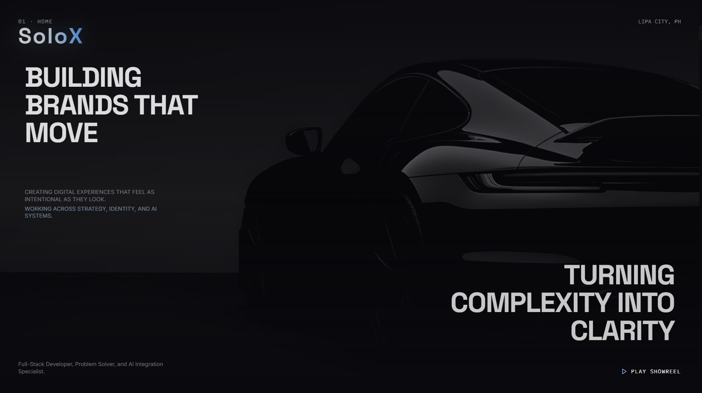

<!-- Header Section: Centered Title, Brand, Typewriter & Custom Banner -->
<div align="center">

  <br /><br />

  <!-- Header Banner Image -->
  
  <h1>Rence Pacifico Samontanez</h1>
  <h3>SoloX</h3>

  <!-- Profile Visitor Counter -->
  
</div>

<br />

---

<!-- Top Brand Showcase Section -->
<div align="center">
  <table>
    <tr>
      <td align="center" width="240">
        
      </td>
      <td valign="middle">
        <h2>⚡ Brand: SoloX</h2>
        <p><b>Creator:</b> Rence Pacifico Samontanez</p>
        <p>Architecting digital experiences with a focus on deep dark aesthetic UIs, fluid animations, and scalable full-stack JavaScript/React applications.</p>
        <p><i>"Engineered for speed, crafted for aesthetics."</i></p>
      </td>
    </tr>
  </table>
</div>

---

### 🏆 Trophies & Achievements

<p align="center">
  
</p>

---

### 🛠️ Tech Stack & Ecosystem

<p align="center">
  <a href="https://skillicons.dev">
    
  </a>
</p>

---

### 📊 Performance & Analytics

<p align="center">
  <picture>
    <source media="(prefers-color-scheme: dark)" srcset="https://github-readme-stats.vercel.app/api?username=RenceSamontanez&show_icons=true&theme=tokyonight&hide_border=true&count_private=true&title_color=38bdf8&icon_color=7dd3fc&bg_color=030712">
    <source media="(prefers-color-scheme: light)" srcset="https://github-readme-stats.vercel.app/api?username=RenceSamontanez&show_icons=true&theme=default&hide_border=true&count_private=true">
    
  </picture>
  <picture>
    <source media="(prefers-color-scheme: dark)" srcset="https://github-readme-stats.vercel.app/api/top-langs/?username=RenceSamontanez&layout=compact&theme=tokyonight&hide_border=true&title_color=38bdf8&langs_count=6&bg_color=030712">
    <source media="(prefers-color-scheme: light)" srcset="https://github-readme-stats.vercel.app/api/top-langs/?username=RenceSamontanez&layout=compact&theme=default&hide_border=true&langs_count=6">
    
  </picture>
</p>

<p align="center">
  
</p>

<!--START_SECTION:waka-->


**🐱 My GitHub Data** 

> 📦 158.1 kB Used in GitHub's Storage 
 > 
> 🏆 140 Contributions in the Year 2026
 > 
> 🚫 Not Opted to Hire
 > 
> 📜 21 Public Repositories 
 > 
> 🔑 0 Private Repositories 
 > 
**I'm a Night 🦉** 

```text
🌞 Morning                46 commits          █████░░░░░░░░░░░░░░░░░░░░   21.80 % 
🌆 Daytime                58 commits          ███████░░░░░░░░░░░░░░░░░░   27.49 % 
🌃 Evening                20 commits          ██░░░░░░░░░░░░░░░░░░░░░░░   09.48 % 
🌙 Night                  87 commits          ██████████░░░░░░░░░░░░░░░   41.23 % 
```
📅 **I'm Most Productive on Friday** 

```text
Monday                   27 commits          ███░░░░░░░░░░░░░░░░░░░░░░   12.80 % 
Tuesday                  6 commits           █░░░░░░░░░░░░░░░░░░░░░░░░   02.84 % 
Wednesday                6 commits           █░░░░░░░░░░░░░░░░░░░░░░░░   02.84 % 
Thursday                 24 commits          ███░░░░░░░░░░░░░░░░░░░░░░   11.37 % 
Friday                   86 commits          ██████████░░░░░░░░░░░░░░░   40.76 % 
Saturday                 8 commits           █░░░░░░░░░░░░░░░░░░░░░░░░   03.79 % 
Sunday                   54 commits          ██████░░░░░░░░░░░░░░░░░░░   25.59 % 
```


📊 **This Week I Spent My Time On** 

```text
🕑︎ Time Zone: Asia/Manila

💬 Programming Languages: 
TypeScript               2 hrs 13 mins       ████████████░░░░░░░░░░░░░   47.16 % 
Other                    2 hrs 3 mins        ███████████░░░░░░░░░░░░░░   43.84 % 
HTML                     23 mins             ██░░░░░░░░░░░░░░░░░░░░░░░   08.19 % 
CSS                      2 mins              ░░░░░░░░░░░░░░░░░░░░░░░░░   00.81 % 

🔥 Editors: 
Agent                    3 hrs 28 mins       ██████████████████░░░░░░░   73.91 % 
Cursor                   1 hr 13 mins        ███████░░░░░░░░░░░░░░░░░░   26.09 % 

🐱‍💻 Projects: 
dedication               1 hr 11 mins        ██████░░░░░░░░░░░░░░░░░░░   25.41 % 
resort                   1 hr 11 mins        ██████░░░░░░░░░░░░░░░░░░░   25.33 % 
rence-portfolio          52 mins             █████░░░░░░░░░░░░░░░░░░░░   18.63 % 
lumiere-resort           50 mins             ████░░░░░░░░░░░░░░░░░░░░░   17.72 % 
romantic-dedication      14 mins             █░░░░░░░░░░░░░░░░░░░░░░░░   04.96 % 

💻 Operating System: 
Windows                  4 hrs 42 mins       █████████████████████████   100.00 % 
```

🤖 **AI Coding This Week** 

```text
⏱ AI Coding Time: 3 hrs 58 mins (84.45%)

✍️ 0 lines written by AI, 870 lines written by hand (0.0% AI-written)

🔤 125,054 Input Tokens, 125,054 Output Tokens

💵 $2.25 Estimated AI Cost This Week

🧠 6 AI Sessions, 105 AI Prompts

Composer                 0 lines             ░░░░░░░░░░░░░░░░░░░░░░░░░   00.00 % 

🔎 AI Coding Insights:
🧑‍💻 Mostly Hands-On — 0.0% of written lines came from AI
📚 Verbose Prompter — average 4,765 characters per prompt
🔁 Iterative Prompter — average 18 prompts per session
🔍 Hands-On Reviewer — 100.0% of changed lines were hand-edited
```

**I Mostly Code in CSS** 

```text
CSS                      6 repos             ████████░░░░░░░░░░░░░░░░░   33.33 % 
TypeScript               5 repos             ███████░░░░░░░░░░░░░░░░░░   27.78 % 
HTML                     4 repos             ██████░░░░░░░░░░░░░░░░░░░   22.22 % 
Dart                     1 repo              █░░░░░░░░░░░░░░░░░░░░░░░░   05.56 % 
Blade                    1 repo              █░░░░░░░░░░░░░░░░░░░░░░░░   05.56 % 
```


**Timeline**


 Last Updated on 10/09/2026 03:48:57 UTC
<!--END_SECTION:waka-->


---

### 🌱 Visual Activity & 3D Skyline

<!-- 3D Contribution City View -->
<p align="center">
  
</p>

<br />

<!-- Contribution Snake -->
<p align="center">
  <picture>
    <source media="(prefers-color-scheme: dark)" srcset="https://raw.githubusercontent.com/RenceSamontanez/RenceSamontanez/output/github-snake-dark.svg">
    <source media="(prefers-color-scheme: light)" srcset="https://raw.githubusercontent.com/RenceSamontanez/RenceSamontanez/output/github-snake.svg">
    
  </picture>
</p>

---

### ⚡ Recent GitHub Activity

<!--START_SECTION:activity-->
* 🚀 Pushed new updates to `SoloXPortfolio`
* 📌 Starred a repository
* 🔀 Merged pull request in `TaskFlow-App`
<!--END_SECTION:activity-->

---


### 📫 Connect With Me

<p align="center">
  <a href="https://www.linkedin.com/in/rensuru" target="_blank">
    
  </a>
  <a href="https://x.com/SamontanezRence" target="_blank">
    
  </a>
  <a href="https://www.facebook.com/rence.samontanez.7/" target="_blank">
    
  </a>
  <a href="https://www.instagram.com/fushigurotojing/" target="_blank">
    
  </a>
  <a href="https://t.me/SoloXRence" target="_blank">
    
  </a>
  <a href="https://wa.me/639451031206?text=Hi%21%20I%20want%20to%20inquire" target="_blank">
    
  </a>
</p>

<!-- Dark Blue / Light Blue Watercolor Gradient Banner -->
<p align="center">
  
</p>

<br />

---

<!-- Bottom Signature Card -->
<div align="center">
  <table>
    <tr>
      <td align="center" width="240">
        
      </td>
      <td valign="middle">
        <h2>Mi vida</h2>
        <p>
          Wherever life takes us, you are the person I want to come home to.
          Through every chapter, every change, every quiet night and every difficult day,
          I want to have you by my side. You are the person I want to laugh with,
          grow with, dream with, and build a life with. No matter where life leads us,
          my heart will always find its way back to you. You are not just someone I love;
          you are my favorite person, my safe place, and the home I choose every day.
        </p>
      </td>
    </tr>
  </table>
</div>
